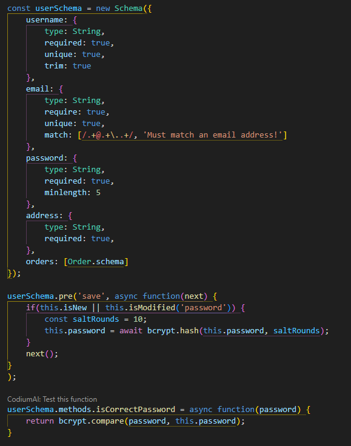

# Logo-Marketplace

## Technology Used

| Badge Name  | Badge                                                                                                                      | Link                                                           |
| ----------- | -------------------------------------------------------------------------------------------------------------------------- | -------------------------------------------------------------- |
| JavaScript  |  | [MDN](https://developer.mozilla.org/en-US/docs/Web/JavaScript) |
| Nodejs      |                                            | [Node.js](https://nodejs.org/en)                               |
| Bcrypt      |                             | [npm](https://www.npmjs.com/package/bcrypt)                    |
| Mongoose    |                   | [Mongoose](https://mongoosejs.com/docs/api/mongoose.html)      |
| Faker       |                                                  | [Faker.js](https://fakerjs.dev)                                |
| Apollo      |                        | [Apollo GraphQL](https://www.apollographql.com/docs/react/)    |
| React-Redux |                        | [React Redux](https://react-redux.js.org)                      |
| React       |                                                    | [React](https://react.dev)                                     |
| Stripe      |                          | [npm](https://www.npmjs.com/package/stripe)                    |
| JWT         |                                             | [JWT](https://jwt.io/introduction)                             |

# Landing Page

[Link to depolyed app](https://logo-marketplace-f9aad311ca28.herokuapp.com/)

# User Stories

- As a user I want to see different products complete with the name image and description and a navbar that allows the user to search, view cart and login/signup. So that I can see which products I'd like to purchase, be able to login or sign up, search for a specific item, and see items I plan to buy in my cart.

- As a user I want to create a new account so that I can purchase products and save my shipping information. So that it will be stored and will not be required to fill out additional times if I choose to make multiple purchases.

- As a user I want to have a logout and account links in the header. So that I can logout if needed and review past orders I have made.

- As a user When I click on the search bar autofill items display as I type. So that I have an easier time searching for the products that I am searching for

- As a user When I click an Item I am taken to product page that will display the full details of the item and be able to specify an amount that I want . So that I can get more information about any item and be able to put and amount of the item before I add it to my cart.

- As a user When I click the checkout I am presented with a detailed breakdown of the Items I have selected with the associated cost and am given the options to edit items amounts or remove items. So that I can edit my cart right before I finalize my purchase

- As a user After item amounts are confirmed by the user, they are presented with a Stripe form to fill out shipping and payment information. So that I can submit my purchase.

- As a user When I confirm my order then I get a receipt page to confirm my order was made along with a confirmation number. So that I know my order is confirmed and be able to track my order with the order number.

## Description

This is general purpose e-commerence website that hosts a variety of different products that are able to be purchased. Complete with cart, stripe, and an order confirmation page.

# Models

- Admin

- Cart

- Category

- Order

- Product

- Store

- User

## Usage

On the page you may login or sign up through the nav links. Once Logged in you can you can click items that you can add to your cart and press the checkout button. Just follow the checkout instructions to make purchase.
[Link to Site](https://logo-marketplace-f9aad311ca28.herokuapp.com/)

Here is video demonstration on how to sign up and purchase an item.
[Link to Video]()

## Learning Points

1. How to use Stripe to make an easy checkout page.
2. How to effectively use React-Redux
3. 

## Author Info

Jarell Chinn

- [GitHub](https://github.com/Jarell-Chinn)

Joel Longares

- [Github](https://github.com/joellongaresjr)

Micheal Mattingly

- [Github](https://github.com/MeanBean87)

Kahren Shirvanyan

- [Github](https://github.com/ShirvanyanKaren)
